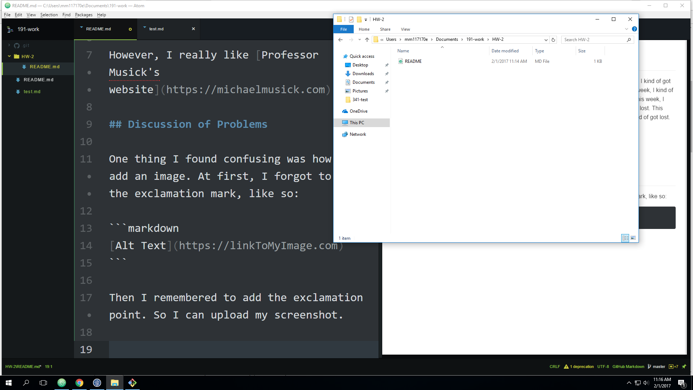

# HW-2 Report

This week, I kind of got lost. This week, I kind of got lost. This week, I kind of got lost. This week, I kind of got lost. This week, I kind of got lost. This week, I kind of got lost. This week, I kind of got lost. This week, I kind of got lost. This week, I kind of got lost. This week, I kind of got lost. This week, I kind of got lost. This week, I kind of got lost. This week, I kind of got lost. This week, I kind of got lost. This week, I kind of got lost. This week, I kind of got lost. This week, I kind of got lost. This week, I kind of got lost. This week, I kind of got lost. This week, I kind of got lost. This week, I kind of got lost. This week, I kind of got lost.

I think I _may_ ~~hate~~ 'be ok with' the professor.  

However, I really like [Professor Musick's website](https://michaelmusick.com).

## Discussion of Problems

One thing I found confusing was how to add an image. At first, I forgot to add the exclamation mark, like so:

```markdown
[Alt Text](https://linkToMyImage.com)
```

Then I remembered to add the exclamation point. So I can upload my screenshot.


